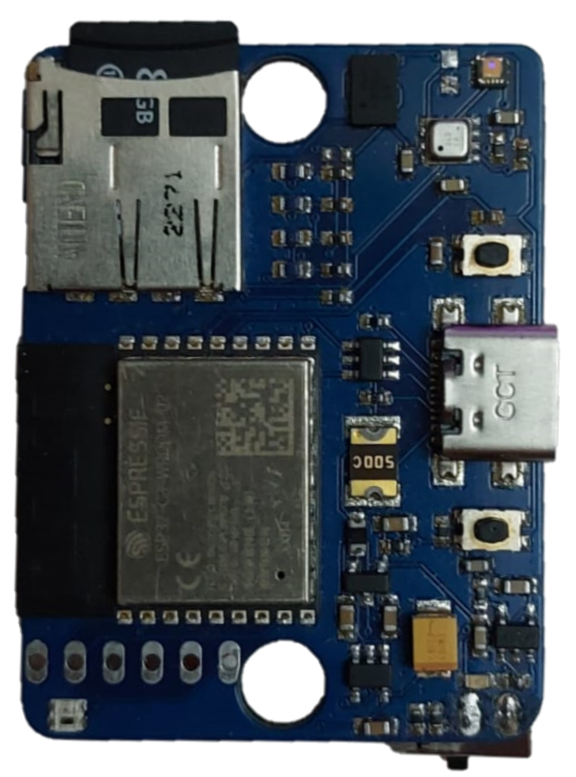

# ESP32 Motion Tracking

## Descriere

Acest repository contine setupul pentru colectare de date cu senzori. Fiecare senzor este plasat pe o anumita zona a corpului, urmand ca acestia sa inregistreze mersul.

Pentru utilizare, am expus un API care o sa fie descris in sectiunile urmatoare.

## Termeni utilizati

``Server`` = placuta folosita pe post de comunicare intre calculator / laptop si senzori

``Peer`` = placile folosite pe post de senzori de colectare

``SERVER_IP`` = ip-ul local al serverului prin care este conectat senzorul la router

``PEER_IP`` = ip-ul local prin care este conectat fiecare peer la router **doar** in **DOWNLOAD_MODE**

``PEERS`` == ``SENZORI`` = referire la senzorii folositi pentru colectare (neincluzand serverul)

## Hardware folosit



Pe langa alte functionalitati, aceasta placuta dispune de un cititor de carduri microSD pe care se salveaza datele si de un accelerometru + giroscop care inregistreaza datele.


## Setup si motivatie infrastructura

Setup-ul este format dintr-o placuta utilizata pe post de server, pentru a expune un API care sa poata fi utilizat prin cereri HTTP si 11 placute folosite pe post de senzori, care comunica individual cu serverul prin protocolul **ESP-NOW** care este low power, consumand mai putin decat daca fiecare senzor ar expune un server web, iar senzorii trebuie sa aiba o durata de viata cat mai ridicata pentru a scadea numarul de incarcari intr-o zi. Serverul este intermediar intre client si peers.


## Replicare setup

Pentru ca setup-ul sa functioneze, este necesar ca serverul sa fie conectat la acelasi router cu laptop-ul / calculatorul folosit pentru lansarea colectarii.

Pentru ca pe server sa functioneze **simultan** si **ESP-NOW** si **WiFi** este necesar ca routerul sa fie setat sa mentina toate conexiunile la internet prin **WiFi** pe **channel 1**. Fara aceasta setare, serverul nu va putea comunica cu niciun senzor.


## Comunicarea client <--> server <--> peer

### Preluarea informatiilor de catre client

Limitarile protocolului **ESP-NOW** nu permit ca datele sa fie preluate de la peers si expuse serverului si clientului conectat la server in aceeasi runda.

In consecinta, comenzile de preluare a timestamp-ului, nivelului de baterie sau verificare existenta fisierului nu pot fi satisfacute in acelasi request.

Rezolvarea acestei limitari ar fi inlantuirea a 2 cereri identice de catre client.

Daca de exemplu se doreste a se afla nivelul bateriei pentru peers, clientul va trebui sa execute urmatoarea secventa de cereri http la server:

1) Prima cerere:
```
<SERVER_IP>/all_bat
```

In cadrul acestei cereri, clientul trasmite serverului ca se doreste nivelul de baterie al peers (prin server http, via WiFi), serverul transmite mai departe tuturor peers cererea (prin ESP-NOW). Aici nu se poate astepta pentru raspunsul de la peers, intrucat este asincron si nu se stie exact la ce diferenta de timp o sa vina, de aceea serverul retine informatia intermediara in buffer si transmite ceea ce are deja la client prin raspuns http fara sa poata actualiza valorile de la peers. Ulterior raspunsului, intr-o perioada de timp relativ scurta, primeste si noile informatii cu nivelul bateriei de la fiecare peer si actualizeaza informatia in buffer-ul local.

Daca aceasta este prima rulare de all_bat (adica nu s-au mai facut cereri de cand a fost serverul pornit), rezultatul ar trebui sa fie:
```
ESP32_1:
ESP32_2:
ESP32_3:
ESP32_4:
ESP32_5:
ESP32_6:
ESP32_7:
ESP32_8:
ESP32_9:
ESP32_10:
ESP32_11:
```
Daca nu este prima rulare, rezultatele afisate sunt de fapt valorile care erau de actualitate la cererea anterioara celei facute acum.

2) Se reintroduce aceeasi cerere http care ar trebui sa raspunda cu valorile pe care clientul le-a vrut cand a dat comanda 1
```
<SERVER_IP>/all_bat
```

Acum, in spate, serverul a primit raspunsurile de la peers si au fost puse noile valori in buffer-ul intern al serverului. Raspunsul cererii:
```
ESP32_1: BATTERY_LEVEL_1
ESP32_2: BATTERY_LEVEL_2
ESP32_3: BATTERY_LEVEL_3
ESP32_4: BATTERY_LEVEL_4
ESP32_5: BATTERY_LEVEL_5
ESP32_6: BATTERY_LEVEL_6
ESP32_7: BATTERY_LEVEL_7
ESP32_8: BATTERY_LEVEL_8
ESP32_9: BATTERY_LEVEL_9
ESP32_10: BATTERY_LEVEL_10
ESP32_11: BATTERY_LEVEL_11
```
unde BATTERY_LEVEL_x este valoarea in volti a nivelului de baterie pentru peer-ul x. Aceste valori sunt de fapt valorile de baterie pe care le aveau peers cand s-a executat comanda 1. In spate, similar comenzii 1, serverul isi actualizeaza bufferul cu noile date primite de la peers in momentul cererii 2.

### Inlantuirea comenzilor

Din cauza numarului ridicat de transferuri efectuate la un moment prin protocolul **ESP-NOW** intre server si toti peers pentru diverse comenzi, pentru a asigura trimiterea cu succes a tuturor pachetelor, este **necesar** si **recomandat** sa se astepte un **minim** de **2-3 secunde** intre transferuri intre comenzile de nivel de baterie, timestamp si existenta fisier si **6-7 secunde** intre **init** si **start**.

### Moduri de functionare peer

O alta limitare a protocolul **ESP-NOW** ar fi lungimea maxima a unui pachet care este de **250 bytes**. Acest aspect nu afecteaza colectarea in sine ci doar preluarea datelor de pe cardurile SD de catre client. Pentru a evita necesitatea scoaterii cardurilor SD, este necesar un mod de a descarca fisierele de pe cardurile SD remote.

O varianta ar fi fost segmentarea unui fisier in mai multe pachete de 250 bytes si trimiterea la server, varianta respinsa din riscul de drop al unui pachet din cauza inlantuirii de mai multe pachete fara o durata de asteptare, iar incluzand aceasta perioada de asteptare, descarcarea ar fi fost mult prea lenta.

Pentru a evita orice risc impus de ESP-NOW, am decis sa separ functionalitatea peers in 2 mari categorii: **COLLECT MODE** si **DOWNLOAD MODE**.

Ideea programului ar fi sa ruleze un server web doar cand este in mod descarcare, astfel se asigura si un transfer mult mai rapid si mult mai sigur (comunicare directa peers <--> client fara server ca intermediar).

Pentru a evita conflictele intre **ESP-NOW** si **WiFi** la nivel de peer, fiecare peer porneste la boot cu modul prestabilit in rularea anterioara. La inceput, toti senzorii pornesc in **COLLECT MODE**.


#### Peer in COLLECT MODE
Pentru trecerea in COLLECT MODE este suficienta repornirea fiecarui peer sau requestul special pentru reintrarea in **COLLECT MODE** din **DOWNLOAD MODE** descris in sectiunea *Utilizare API*. 

Clientul comunica cu serverul si serverul comunica cu fiecare peer prin **ESP-NOW**, asadar nu exista comunicare directa client <--> peer.

In acest mod, se pot colecta date, prin API-ul prezentat la sectiunea *Utilizare API Server*.

#### Peer in DOWNLOAD MODE
Fiecare peer va expune un server web pe ip-ul pe care il afiseaza in seriala la initializare (in setupul curent el este fix si se cunoaste la fiecare conectare, fiind facuta corespondenta din router prin adresa MAC unica a fiecarei placute).

In acest mod, senzorii nu vor comunica cu serverul, comunicarea prin protocolul esp-now fiind oprita la nivelul fiecarui senzor. Senzorii vor comunica fiecare direct cu clientul si clientul va comunica cu senzorii prin server http tinut pe fiecare senzor.

API-ul folosit pentru acest mod este cel prezentat mai jos la sectiunea *Utilizare API Peer in DOWNLOAD MODE*.


## Utilizare API

### Utilizare API Server

Serverul expune printr-un server web asincron o interfata pentru cereri http. Pentru ca pe server sa functioneze si protocolul ESP-NOW simultan, vezi sectiunea "Replicare setup". Exista si un server web expus de **peers** care este prezent doar in **DOWNLOAD_MODE**.

Pentru comenzi care presupune preluarea datelor de la peers precum <em>all_timestamp (3)</em>, <em>all_bat (4)</em> sau <em>file_exists (5)</em> de mai jos, vezi sectiunea **Comunicarea client <--> server <--> peer**.

Cererile expuse de server **permanent** sunt:

1) Verificare daca serverul este activ

```
<SERVER_IP>/isalive
```

2) Pentru a sincroniza ceasul fiecarui **peer** cu ceasul curent al **serverului**
```
<SERVER_IP>/sync
```

3) Pentru a verifica timestamp-ul de pe fiecare peer
```
<SERVER_IP>/all_timestamp
```

4) Pentru a verifica nivelul de baterie al fiecarui peer
```
<SERVER_IP>/all_bat
```

5) Pentru a verifica daca fisierul cu numele <em><file_name></em> exista pe fiecare card SD al fiecarui peer
```
<SERVER_IP>/file_exists?file=<file_name>
```

6) Pentru a genera fisierul de colectare pentru runda curenta cu numele <em><file_name></em> (**Observatie**: Doar se creeaza fisierul si se porneste timerul, preluarea datelor de la accelerometru, giroscop si scrierea acestora nu sunt pornite)
```
<SERVER_IP>/init?file=<file_name>
```

7) Pentru a incepe preluarea datelor de la accelerometru, giroscop si scrierea lor pe cardul SD
```
<SERVER_IP>/start
```

8) Pentru a opri runda de colectare
```
<SERVER_IP>/stop
```

9) Pentru a muta toti peers in modul **DOWNLOAD_MODE** (**Observatie**: Aceasta cerere va pune toti peers in DOWNLOAD_MODE, ceea ce inseamna ca acestia nu mai pot comunica cu serverul prin **ESP-NOW**, pentru mai multe informatii, exista sectiunea *Moduri de functionare peer* din *Comunicarea client <--> server <--> peer*)
```
<SERVER_IP>/enable_download
```

### Utilizare API Peer in DOWNLOAD MODE
Cererile realizate de catre client trebuie facute pentru fiecare senzor in parte.

Cererile expuse de peer in DOWNLOAD MODE sunt:

1. Pentru a porni descarcarea unui fisier cu numele *<file_name>* de la peer-ul cu ip-ul *<PEER_IP>*
```
<PEER_IP>/download?file=<file_name>
```

2. Pentru a muta senzorul in COLLECT MODE (se recomanda verificarea statusului fiecarui senzor la trecerea inapoi in COLLECT MODE prin verificarea comunicarii cu serverul, de testat nivelul bateriei si resincronizat timestamp-ul)
```
<ESP_IP>/disable_download
```

## Good practice

Comenzile la care se fac referiri mai jos sunt corelate cu cele de la *Utilizare API Server*.

### Se recomanda:

1) sincronizarea (prin ``sync``, comanda 2) a tuturor senzorilor inainte de a incepe o secventa de colectare.
2) verificarea existentei fisierelor de la colectarea curenta pentru toti peers (comanda 5).
3) Verificarea log-urilor din seriala la care este conectat serverul la client si monitorizarea trimiterii pachetelor, se vrea aparitia doar a mesajului *"Delivery Success"*, mare atentie la mesajul *"Delivery Fail"* care semnifica faptul ca un pachet trimis de server nu a putut fi primit de un peer. Recomandare: reincercare secventa anterioara (reluarea colectarii rundei curente / comenzii date care a generat problema) iar daca problema persista, verificarea nivelului bateriei (comanda 4). Daca acesta este sub **3.6 - 3.7V**, aceasta ar putea fi sursa problemei (o reincarcare a senzorilor ar trebui sa rezolve problema).
4) Descarcarea fisierelor la fiecare 3-4 colectari complete.

### Se impune:
1) Sincronizarea prin comanda 2 in momentul primei porniri a senzorilor.
2) Verificarea fiecarui led de pe senzori, sa nu fie aprins (culoarea rosu semnifica eroare de initializare)
3) Verificarea serverului la inceputul colectarilor (comanda 1) si asteptarea raspunsului **"Yes"**.
4) Descarcarea tuturor fisierelor inregistrare in ziua respectiva.
5) Verificarea constanta a nivelului de baterie (comanda 4) pentru toti peers la fiecare **3-4** colectari.
6) Incarcarea senzorilor in momentul in care minimul de nivel de baterie atinge **3.6V**.
7) Cunoasterea modului curent de functionare al senzorilor (DOWNLOAD MODE sau COLLECT MODE) pentru a stii cum se interactioneaza cu API-ul.
8) Asteptarea timpilor prezentati mai sus pentru comenzi dar si asteptarea a **7-8 secunde** la momentul trecerii intre DOWNLOAD MODE si COLLECT MODE.
9) **Resincronizarea** (comanda 2 in COLLECT_MODE) senzorilor dupa trecerea din DOWNLOAD MODE in COLLECT MODE.
10) Toti senzorii trebuie sa fie in **acelasi mod**, daca apar variatiuni (o parte din senzori sunt in DOWNLOAD MODE si cealalta in COLLECT MODE) se impune repornirea prin switch a tuturor senzorilor.